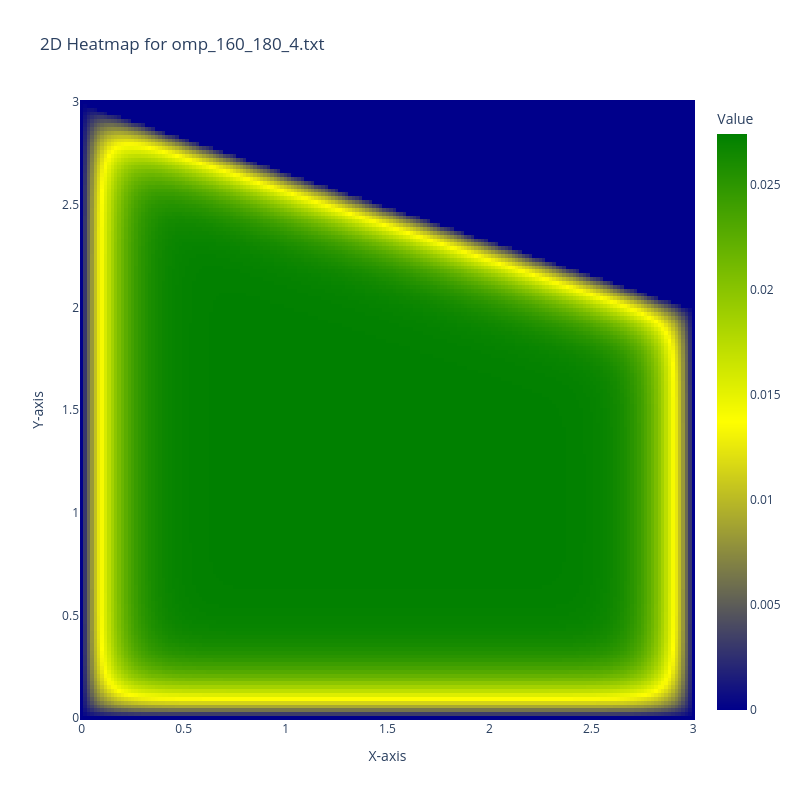

# Overview:


This program solves Dirichlet problem
```math
k(x, y) = 
\begin{cases} 
-\Delta{u} = f(x,y), & (x,y) \in D \\ 
u(x, y) = 0, & (x,y) \in \gamma
\end{cases} 
```


for a D, that is right trapezoid with next nodes:
$A(0,0)$, $B(3,0)$, $C(2,3)$, $D(0,3)$, - $\gamma$ is its boarder and $f(x, y) = 1 \quad \forall (x,y) \in D$.

The goal is to build accurate and parallel solution, using **OpenMP** and 
**MPI** libraries. Moreover launch it on Moscow State University 
[Polus](http://hpc.cmc.msu.ru/polus) computing complex.


## Project description

1. [Mathematical model of solution](docs/math_model.md).
2. [Difference Scheme for Solving the Problem](docs/diff_schema.md)
3. [Method for Solving Systems of Linear Algebraic Equations](docs/math_model.md)
4. [OpenMP implementation](docs/omp.md)
5. [Solution plots](docs/sol_images.md)
6. [MPI implementation](docs/mpi.md)
6. [MPI/OpenMP implementation](docs/mpi+omp.md)

## Results representation

### Heatmap for solution on grid (M, N) = (160, 180)


# Installation
Clone repository and download python package manager and create venv
```
curl -sSL https://pdm-project.org/install-pdm.py | python3 -
pdm install
```

## For IMP Polus:
To automatically send required code `./Polus/` to your remote Polus space
go to `dodo.py`, change user name in line 15 correspondingly to yours and run
```
doit send
```
After that switch to remote.
Extract `sm24.zip` archive and go to `your_folder_name/Polus/`.

### Launch
You can manfully change grid size in *.cpp files. To change number of processes
or threads open needed *.lsf.
1. `bsub < mpi.lsf` - runs MPI+OpenMP version
2. `bsub < omp.lsf` - runs OpenMP version

## For local testing:
Run CLI command from root directory to create executables:
```
doit build
```
Only `main.cpp`, `mainMPI.cpp` and `mainMPIOpenMP.cpp` are targeted. 

### Launch
You can manfully change grid size or number of threads in 
1. `./main` - run basic and OpenMP version of program
2. `mpirun -np N ./mpi` - runs MPI version with N processes
3. `mpirun -np N ./ompmpi` - runs MPI+OpenMP version with N processes

All output data would be saved in `build` directory.
To create the heatmaps run from root directory command `doit figures`.

