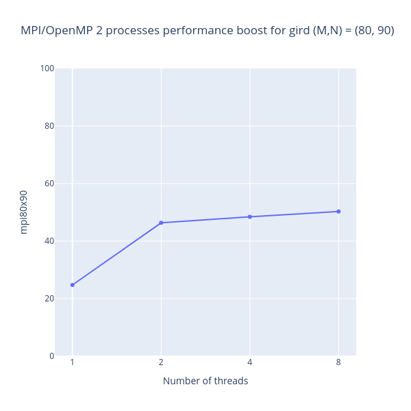
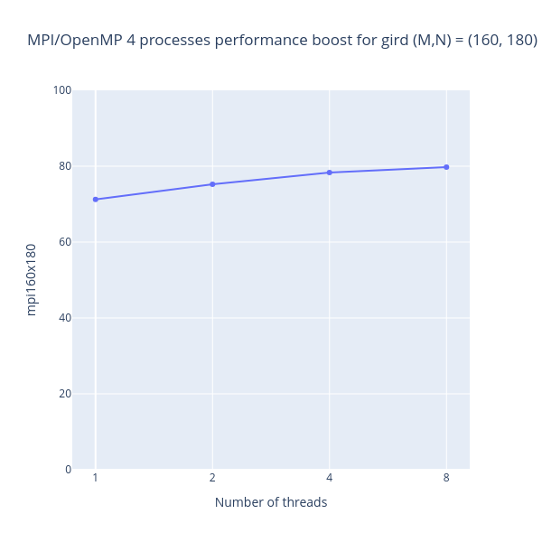

# MPI/OpenMP implementation

In this section I've combined two previously created approaches MPI and OpenMP.
Best way to complement MPI solution with OpenMP is to use threading in 
part, connecting to calculation of coefficients $a_{ij}$, $b_{ij}$ and $F_{ij}$.
In other cases I didn't see reasons or speed boost in applying OpenMP.

## Performance boost

Linear solution took *330.899* $\sec$ for 80 x 90 and *1357.654* $\sec$ for 
160 x 180.

| Processes | Threads   | Grid size  (M x N)  | Iter  | CPU Time ($\sec $) | Boost %  |
|---|---|---|---|---|---|
| 2 | 1 | 80 x 90 | 1 000 000 | 248.968 | 24.76  |
| 2 | 2 | 80 x 90 | 1 000 000 | 177.511 | 46.35 |
| 2 | 4 | 80 x 90 | 1 000 000 | 170.512 | 48.47 |
| 2 | 8 | 80 x 90 | 1 000 000 | 164.424 | 50.31 |
| 4 | 1 | 160 x 180 | 1 000 000 | 390.325 | 71.25 |
| 4 | 2 | 160 x 180 | 1 000 000 | 336.155 | 75.24 |
| 4 | 4 | 160 x 180 | 1 000 000 | 294.339 | 78.32 |
| 4 | 8 | 160 x 180 | 1 000 000 | 274.517 | 79.78 |

## Visualization
| 
80 x 90
 | 
 160 x 180 
 |
|-|-|
|  |  |

