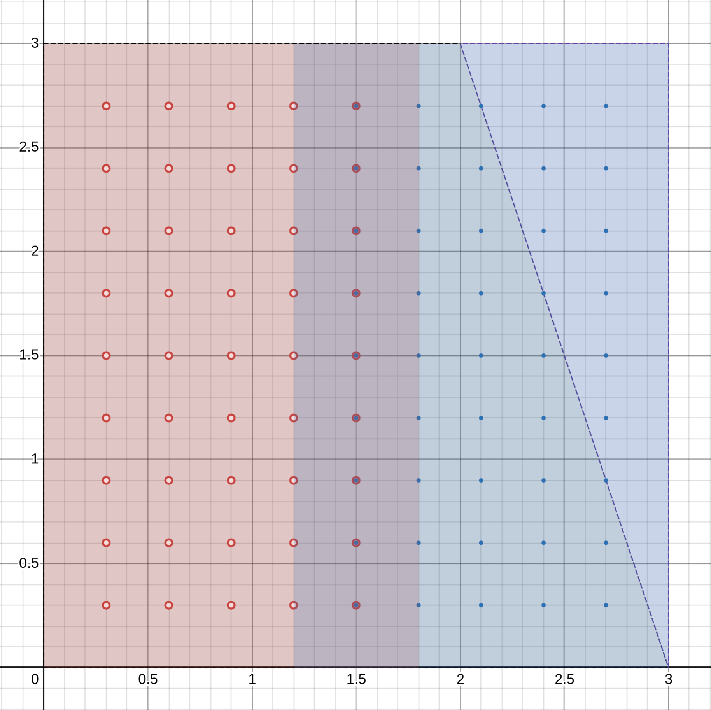

# MPI implementation
We will try to use 1, 2 and 4 process for finding solution. The idea behind it
is that we can create separate tasks in rectangle subareas so that solution
in will be building in different part of the plane simultaneously.
Let's see how the process should communicate, based on their number.

## 2 processes
### Concept
In this case everything is simple: process 0 send data to process 1 and
receive data from it, same for process 1. Below is 
illustration of data transfer:


### Example
Let's consider grid $(M, N) = (6, 6)$ and next division on domains.
The goal is to receive boarder values, calculated in another process and
to have ration $nodes_{x} / nodes_{y} \in [\frac{1}{2}, 2]$ for each domains.
If we divide square evenly ($x=1.5$), then the ration is equals $3/5$ and is
greater then $1/2$. \
Calculate values on that line twice is not a big deal. We would ignore them for
one of the processes, when glueing up two domains.



## 4 process
### Concept
In this case connection became more complex. Each sub-rectangle contains
boarder values of all neighboring ones: next, previous and adjacent.
However let's limit out scope on building binary communication. By that 
word I mean sending and receiving in two circles: clockwise (arrows **A**) and
counterclockwise (arrows **B**). \
For instance:
First domain **0** (the green one) send data to bottom **1** (the red one)
and right **3** (the blue one) neighboring domains. After that it 
receives data out of those areas. \
As a result you can see that we get two circular connections.


### Example
Again grid size is chosen $(6, 6)$, but now we have four sub-rectangles. \
All nodes rations are equal $3/3 =1$


## Detailed description

On each iteration of solution search each process has to:
1. Calculate residuals $r$
    * Exchange boarder values with neighboring domains
2. Calculate step $\tau$ nominator and denominator
    * Use residuals
    * Gather information from all processes and summaries nominators and 
    denominators
    * Calculate mutual step
3. Calculate solution $w$
    * Use step $\tau$
    * Exchange boarder values with neighboring domains
4. Calculate maximum of $||w^{k+1} - w^{k}||$
    * Use solution
    * Gather information from all processes and find maximal norma


At the end if norma is less then chosen tolerance $\delta$ or iteration limit
being reached, then all local solution are being send to *master* process. 
There they are being joined and saved to file.

## Performance boost

Local machine CPU information:
```
Architecture:             x86_64
  CPU op-mode(s):         32-bit, 64-bit
  Address sizes:          48 bits physical, 48 bits virtual
  Byte Order:             Little Endian
CPU(s):                   16
  On-line CPU(s) list:    0-15
Vendor ID:                AuthenticAMD
  Model name:             AMD Ryzen 7 5800H with Radeon Graphics
```
Linear solution took 1803410 $\mu s$ (microseconds). 

| Processes   | Grid size  (M x N)  | Iter  | CPU Time ($\mu s$) | Boost %  |
|---|---|---|---|---|
| 1 | 40 x 40 | 100 000  | 1811626  | -0.45  |
| 2 |  40 x 40 | 100 000  | 1264666 | 29.87 |
| 4 |  40 x 40 | 100 000  | 855352 | 52.57  |