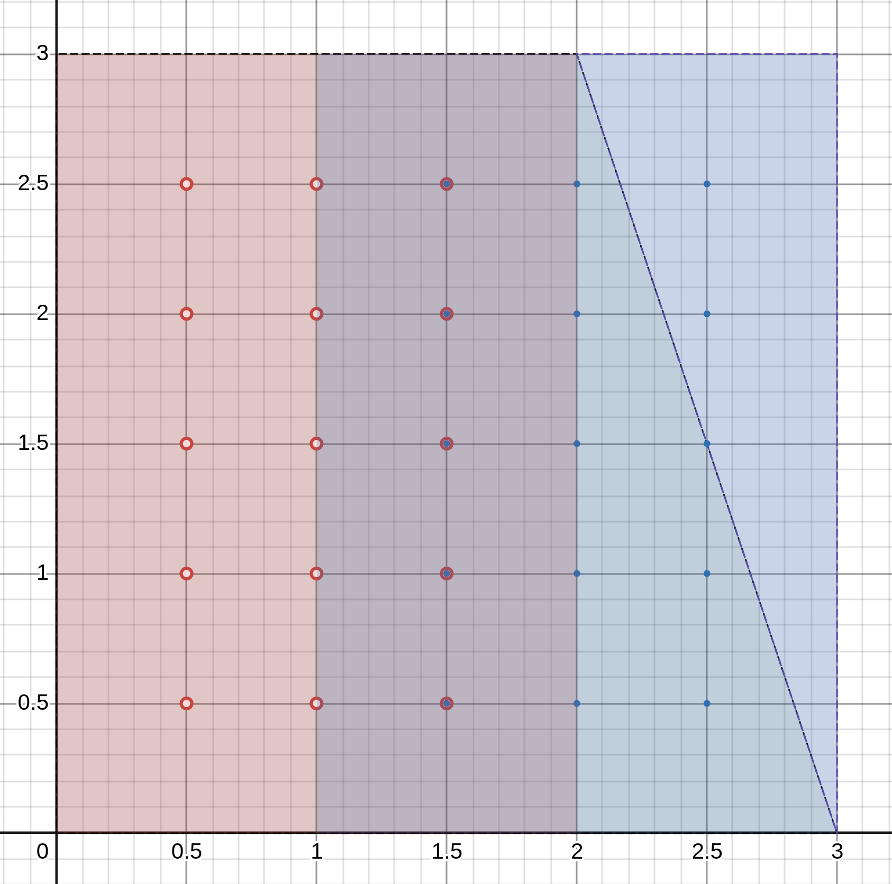

# MPI implementation
We will try to use 1, 2 and 4 process for finding solution. The idea behind it
is that we can create separate tasks in rectangle subareas so that solution
in will be building in different part of the plane simultaneously.
Let's see how the process should communicate, based on their number.

## 2 processes
### Concept
In this case everything is simple: process 0 send data to process 1 and
receive data from process 1, analogically is for process 1. Below is 
illustration of data transfer:

### Example
Let's consider grid $(M, N) = (10, 10)$. If we divide square evenly ($x=1.5$), 
then we would have issue with boarder values on that line. However goal is to 
receive boarder values, calculated in another process. Therefore let's add
extra nodes for first (red) area and give rest to the second (blue) area.
Nodes ration $\frac{x}{y}$ for those areas are correspondingly equals: $6/11$
and $5/11$

## 4 process
### Concept
In this case connection became more complex. Each sub-rectangle contains
boarder values of all neighboring ones: next (arrows *A*), previous (arrows *B*)
and adjacent (arrows *C*). It's not obvious why should be communicate with 3,
but not 2 process. To get the answer you may look on example below.

### Example
Again grid size is chosen $(10, 10)$, but now we have four sub-rectangles. 
As you can see process 3, for instance, contains:
* bottom boarder values of area, processed by process 0
* right boarder values of area, processed by process 2
* on bottom right vertex of area, processed by process 3
Therefore, as were mentioned, data should be sended three times and be received
three times.

Nodes rations are as follow: $\frac{x_0}{y_0} = 6 / 5$,
$\frac{x_1}{y_1} = 5 / 5$, $\frac{x_2}{y_2} = 5 / 6$, $\frac{x_3}{y_3} = 6 / 6$

