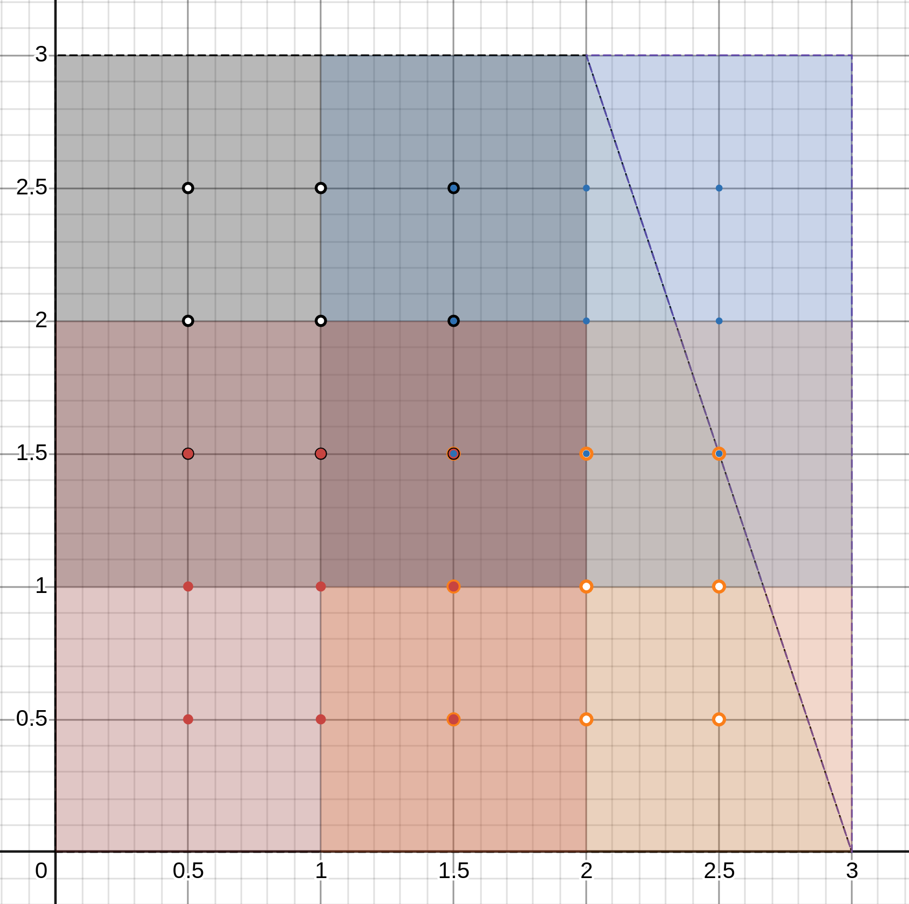

# MPI implementation
We will try to use 1, 2 and 4 process for finding solution. The idea behind it
is that we can create separate tasks in rectangle subareas so that solution
in will be building in different part of the plane simultaneously.
Let's see how the process should communicate, based on their number.

## 2 processes
### Concept
In this case everything is simple: process 0 send data to process 1 and
receive data from process 1, analogically is for process 1. Below is 
illustration of data transfer:

### Example
Let's consider grid $(M, N) = (10, 10)$. If we divide square evenly ($x=1.5$), 
then we would have issue with boarder values on that line. However the goal is 
to receive boarder values, calculated in another process. Therefore let's add
extra nodes for first (red) and second (blue) areas.
Nodes ration $\frac{x}{y}$ for those areas are equal $5/9$.

## 4 process
### Concept
In this case connection became more complex. Each sub-rectangle contains
boarder values of all neighboring ones: next, previous and adjacent.
However the idea is to calculate solution in first area **0** (the green one).
After that initialize values in grid nodes of second area **1** with bottom 
row of green area. Then initialize values for third area **2** with side right
column of red area. Then use orange top row to initialize values for last,
blue area **3**.

Even process would send first, odd - receive.
Notion: BV - bottom values, TV - top values, RV - right values,
LV - left values, additional B in beginning correspond to "boarder"

So work should be done in the next manure:

0. Calculate solution -> send BV to 1 -> send RV to 3 ->
receive BRV from 3 -> receive BBV from 1 -> calculate solution ->
send data to master process
2. Calculate solution -> send TV to 3 -> send LV to 1 ->
receive BTV from 3 -> receive BLV from 1 -> calculate solution ->
send data to master process

1. Receive BTV from 0 -> receive BRV from 2 -> calculate solution -> 
send TV to 0 -> send RV to 2 ->
send data to master process
3. (MASTER) Receive BLV from 0 -> receive BTV from 2 -> calculate solution -> 
send BV to 2 -> send LV to 0 -> receive data from other processes ->
save solution to txt file

### Example
Again grid size is chosen $(10, 10)$, but now we have four sub-rectangles. 

All nodes rations are equal $5/5 =1$

