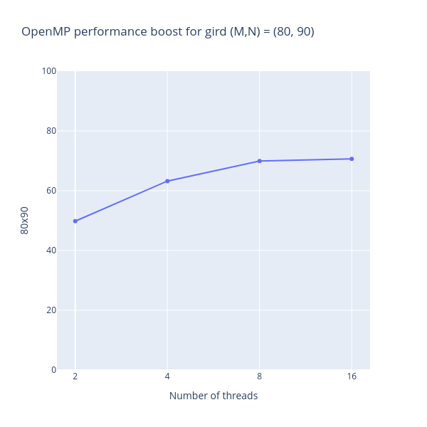
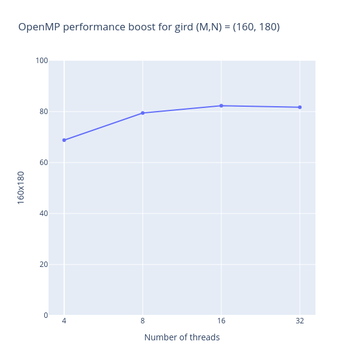

# OpenMP implementation

The described problem requires calculation on plane. Therefor we are obliged to
iterate with double `for` loops.

## Usage in code

Calculation of $a_{ij}$, $b_{ij}$, $F_{ij}$, $w_{ij}$ requires double 
for-loop. Therefor they were provided with OpenMP.

Used constructions:

1. **omp_set_dynamic(0)** \
This function is called to disable dynamic adjustment of the number of threads.
When you set it to 0, it means that the OpenMP runtime should not change the
number of threads during execution based on runtime conditions. By default, the
OpenMP runtime could adjust thread counts dynamically to optimize performance
based on workload, but disabling this can lead to more predictable behavior,
particularly beneficial for applications where workload is known in advance and
is stable.
2. **omp_set_num_threads(N)**  \
This function is used to set the number of threads to be used for parallel
sections of the code. Here, N would typically be an integer representing the
number of threads to use for parallel execution. By calling this
function, you can control parallelism manually rather than relying on OpenMP's
default behavior. 

Used pragmas:

1. **omp parallel for collapse(2)** \
This pragma is used to denote that the following loop (or loops) should be
executed in parallel.
The collapse(2) clause indicates that OpenMP should treat nested loops as 
a single loop with a larger number of iterations. This is useful
when you want to increase the granularity of the parallelism by combining the
iterations of multiple loops into a single set of iterations. For instance,
two loops that each iterate over M and N iterations respectively,
collapsing them will treat the combined iterations as M * N total iterations
for distributing among available threads.
2. **omp parallel for reduction(+ : res)** \
This pragma permits parallel execution of the following for loop, where the
results from each thread (or iteration) are combined at the end.
The reduction(+ : res) clause specifies that the variable res should be reduced
using the addition operator (+). Each thread computes its own partial sum, and
at the end of the parallel region, these partial sums are added together to
yield the final result stored in res. The reduction is crucial because it
handles potential data races on res by ensuring that each thread has its
private version of res that is then combined safely.

## Performance boost

Local machine CPU information:
```
Architecture:             x86_64
  CPU op-mode(s):         32-bit, 64-bit
  Address sizes:          48 bits physical, 48 bits virtual
  Byte Order:             Little Endian
CPU(s):                   16
  On-line CPU(s) list:    0-15
Vendor ID:                AuthenticAMD
  Model name:             AMD Ryzen 7 5800H with Radeon Graphics
```

Linear solution took *1.803* $\sec$. 

| Threads   | Grid size  (M x N)  | Iter  | CPU Time ($\sec$) | Boost %  |
|---|---|---|---|---|
| 1 | 40 x 40 | 100 000  | 1.59 | 11.74  |
| 4 | 40 x 40 | 100 000  | 1.30 | 27.74  |
| 16 | 40 x 40 | 100 000  | 1.36 | 27.00  |

On Polus:

Linear solution took *330.899* $\sec$ for 80 x 90 and *1357.654* $\sec$ for 
160 x 180.

| Threads   | Grid size  (M x N)  | Iter  | CPU Time ($\sec $) | Boost %  |
|---|---|---|---|---|
| 2 | 80 x 90 | 1 000 000 | 195.778  | 40.83  |
| 4 | 80 x 90 | 1 000 000 | 121.671  | 63.23  |
| 8 | 80 x 90 | 1 000 000 | 99.431 | 69.95  |
| 16 | 80 x 90 | 1 000 000 | 97.041  | 70.67  |
| 4 | 160 x 180 | 1 000 000 | 423.549  | 68.80  |
| 8 | 160 x 180 | 1 000 000 | 278.893 | 79.46  |
| 16 | 160 x 180 | 1 000 000 | 239.975 | 82.32  |
| 32 | 160 x 180 | 1 000 000 | 248.417 |  81.70 |


## Visualization
| <center>80 x 90</center> | <center> 160 x 180 </center> |
|-|-|
|  |  |

