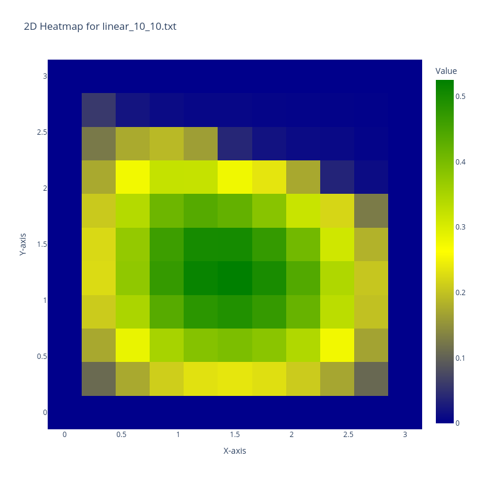
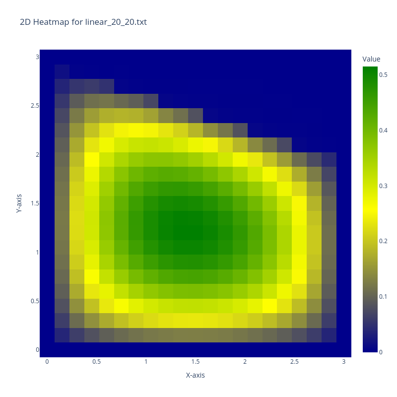
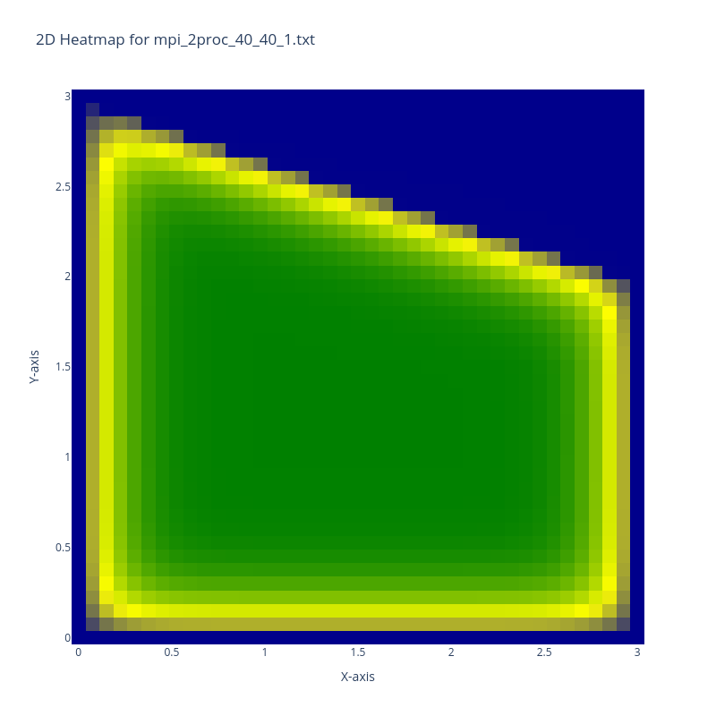

# Hit maps 
## 1. Linear solution
### 1.1. N=10, M=10

### 1.2. N=20, M=20

### 1.3. N=40, M=40

## 2. OpenMP solution
### 2.1. N=40, M=40, 1 thread

### 2.2. N=40, M=40, 4 threads

### 2.3. N=40, M=40, 16 threads

## 3. MPI solution
### 3.1. N=40, M=40, 1 process 

### 3.2. N=40, M=40, 2 processes 

### 3.3. N=40, M=40, 4 processes 
